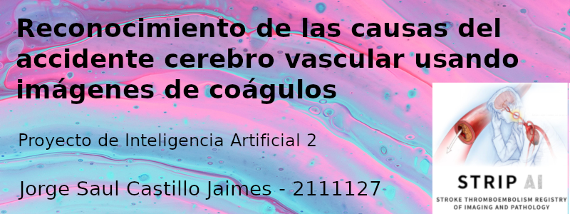

## Proyecto de Inteligencia Artificial 2 - UIS 

### Reconocimiento de las causas de los accidentes cerebrovasculares usando imágenes de coágulos

El presente proyecto está basado en el [curso de Inteligencia Artificial 2](https://gitlab.com/bivl2ab/academico/cursos-uis/ai/ai-2-uis-student) guiado por el docente [PhD. Fabio Martinez Carrillo](https://scholar.google.com/citations?user=ee56iy4AAAAJ&hl=es).

#### Autor
Jorge Saul Castillo Jaimes

#### Objetivo
El objetivo del presente proyecto es poder identificar las causas de los accidentes cerebrovasculares, en al menos 3 categorías: CE, LAA y otras; todo esto con la finalidad de que frente a un primer accidente que presente una persona poder brindar un tratamiento terapéutico adecuado y evitar un segundo accidente.

#### Dataset
El dataset usado para este proyecto está basado en un [reto de la página Kaggle planteado por la Clínica Mayo](https://www.kaggle.com/competitions/mayo-clinic-strip-ai/data). En este se pueden encontrar 1.150 imágenes para entrenamientos entre las 3 clases mencionadas; así como los archivos `.csv` para poder colocar los labels de manera adecuada.

Frente al inconveniente del procesamiento de cómputo por el tamaño y peso de las imágenes, se realizó un ventaneo previo y se escogieron 1.000 imágenes por clase las cuales puede encontrar en el presente repositorio en la carpeta [Dataset](/Dataset).

#### Video resumen
A continuación podrá reproducir un video resumen del proyecto, en donde se muestra la información clave así como los resultados y conclusiones, que también se pueden encontrar en las [diapositivas anexas en este repositorio](Reconocimiento de causas de accidentes cerebrovasculares usando imágenes de coágulos.pptx).

Aquí el video, o lo pueden observar en [YouTube](https://www.youtube.com/watch?v=CG-QkKukAb0):

<figure class="video_container">
  <video controls="true" allowfullscreen="true">
    <source src="video.mp4" type="video/mp4">
  </video>
</figure>

#### Código
El código usado para abordar este proyecto se divide en dos:

1. [Preprocesamiento de imágenes:](Image Preprocessing.ipynb) Aquí descargan las imágenes de kaggle, se pasan de .tif a .png y se hace el ventaneo respectivo. A medida que se van descargando se va haciendo el proceso y eliminando las imágenes para no ocupar tanto espacio en disco duro.

2. [Entrenamiento del clasificador:](Project_Mayo_Clinic_Strip.ipynb) Aquí se leen las imágenes previamente preprocesadas y se entrenand las CNN para comprobar la idea inicial de que sirven como método para clasificar las cuasas según los coágulos.

